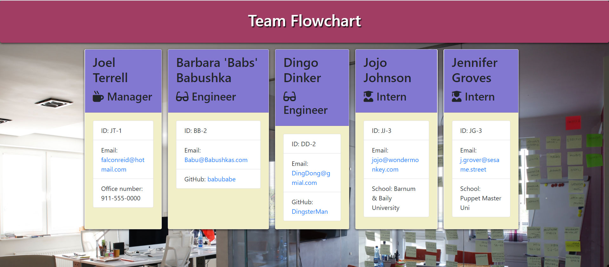

# Team-Generation-CLI

## Description:

This is an office team generator CLI application for Node.js. The application prompts the user (the manager) for information about themselves and then information about the other team members. The user can input any number of team members, and they may be a mix of engineers and interns. Emails must be validated as a proper email type.

### User story:

As a manager:
I want to generate a webpage that displays my team's basic info
so that I have quick access to emails and GitHub profiles

### Installation:

npm i to install all dependencies.

### Usage:

run 'node app.js' and then enter in all pertinent information. Open up team.html from the output folder in your browser upon completion.

### Tests:

The software was built using tests in Jest on each class for Employee, Manager, Engineer and Intern.
To run tests: npm run test

### Dependencies:

Inquirer

Path

fs

Jest

### Screenshots:

### Contact Info:

[Github Profile](https://github.com/falconreid/Team-Generation-CLI)

[LinkedIn Profile](https://www.linkedin.com/in/joelterrell/)
